# 📊 WhatsApp Data Analysis Project

[](https://www.python.org/)
[](https://streamlit.io/)
[](LICENSE)

Analyze and visualize WhatsApp chat exports with a powerful, intuitive, and customizable Python tool!
Get insights into messaging patterns, conversation starters, most active users, and much more.
---
## 🚀 Live Demo

Check out the deployed app on **Streamlit Cloud**:


🔗 ```https://whatsapp-data-analysis.streamlit.app/```

---

## 📖 Table of Contents

- [✨ Key Features](#-key-features)
- [📚 Core Modules](#-core-modules)
- [👢 Project Structure](#-project-structure)
- [📑 Main Application Pseudocode (Español)](#-main-application-pseudocode-español)
- [🧠 Main Flowchart](#-main-flowchart)
- [🔗 Dependencies (main)](#-dependencies-main)
- [🛠 Configuration](#-configuration)
- [⚡ Quick Start](#-quick-start)
- [📋 How to Use](#-how-to-use)
- [🔗 Dependencies (detailed)](#-dependencies)
- [👍🏼 How to Contribute](#-how-to-contribute)
- [🛠️ Contribution Workflow](#️-contribution-workflow)
- [📜 Good Practices](#-good-practices)
- [📢 Need Help?](#-need-help)
- [📜 License](#-license)
- [🚀 Happy Analyzing and Contributing!](#-happy-analyzing-and-contributing)
- [👥 Project Contributors](#-project-contributors)


---

## ✨ Key Features

|                               |                                                                                         |
| ----------------------------- | --------------------------------------------------------------------------------------- |
| 📜 **Robust parser**          | Handles Android & iOS exports, multi‑line messages, 12/24‑hour times and AM/PM formats. |
| 🧹 **Automatic cleaning**     | YAML‑driven rules remove system messages, deleted placeholders and media notes.         |
| 📈 **Interactive dashboards** | Tables & charts switchable via a Hydralit navigation bar.                               |
| 💬 **Conversation starters**  | Detect who breaks the ice using configurable idle gaps (default 60 min).                |
| 🔗 **Link analytics**         | Extract, count and display the most shared URLs in the chat.                            |
| ☁️ **Word clouds**            | Visualise the vocabulary once links & short words are filtered.                         |
| ⏱️ **Smart caching**          | Heavy processing runs once and is cached with `st.session_state`.                       |
| 🌐 **Multilingual**           | Works out‑of‑the‑box for English & Spanish chats.                                       |
| 🎨 **Custom theme**           | Easily tweak colours and layout through Hydralit Components.                            |


---
## 📚 Core Modules
👉 All core logic is located in the [`app/`](./app/) folder.

Use this section to navigate directly to each functional module within the app's architecture:


| Module                       | Description                                                                                                                                                    |
| ---------------------------- | -------------------------------------------------------------------------------------------------------------------------------------------------------------- |
| [`pipeline/`](app/pipeline/) | Handles chat parsing, timestamp conversion, and message cleaning via YAML-based rules. Converts raw `.txt` files into structured DataFrames.                   |
| [`analysis/`](app/analysis/) | Performs statistical analysis such as message frequency, conversation starters, and link detection. Also includes visualization logic (matplotlib, wordcloud). |
| [`services/`](app/services/) | Coordinates the full analysis pipeline, manages caching via `st.session_state`, and returns results for display in the UI.                                     |
| [`ui/`](app/ui/)             | Renders the frontend with Streamlit and Hydralit. Includes navigation, KPI cards, interactive tables, and chart layout components.                             |
---


## 👢 Project Structure

```bash
whatsapp-data-analysis/
│   .gitignore
│   environment.yml
│   main.py
│   README.md
│
├───.streamlit
│       config.toml
│
├───app
│   │   __init__.py
│   │
│   ├───analysis
│   │   │   analizar_inicios.py
│   │   │   stats.py
│   │   │   visualization.py
│   │   └───__init__.py
│   │
│   ├───pipeline
│   │   │   chat_parser.py
│   │   │   chat_to_df.py
│   │   │   clean_dataframe.py
│   │   │   config.yaml
│   │   └───__init__.py
│   │
│   ├───services
│   │   │   compute_data.py
│   │   │   data_manager.py
│   │   └───__init__.py
│   │
│   │
│   └───ui
│       │   optionbar.py
│       │   render_pages.py
│       │   stats_cards.py
│       └───__init__.py
└───static
   │    logo.png
   └─── logo_icon.png
```
---
## 📑 Main Application Pseudocode (Español)

```text
1  Iniciar
2  Configurar página Streamlit
      • título      = "WhatsApp Chat Analyzer"
      • icono       = "static/logo_icon.png"
      • layout      = wide
      • sidebar     = collapsed

3  Crear 2 columnas (1 : 15) para el encabezado
      3.1  En col1 → mostrar imagen logo (120 px)
      3.2  En col2 → mostrar título de la app

4  Crear 3 columnas (1 : 2 : 1) para el uploader
      4.1  En columna central
           • Mostrar st.file_uploader  (solo .txt)
           • Si no hay archivo:
               ◦ Mostrar info
               ◦ Detener ejecución (st.stop)

5  Obtener datos procesados ← get_data(uploaded_file)
      • Manejar StopException → detener app

6  Mostrar tarjetas KPI      ← cards_show(df)
7  Dibujar divisor

8  Mostrar barra de opciones ← draw_optionbar()
      • Si None → "Tables"

9  Según opción:
      • "Tables"        → render_tables(dframes)
      • "Visualization" → render_charts(figs)

10 Fin
```
---
## 🧠 Main Flowchart



---
## 🔗 Dependencies (main)

* pandas • numpy
* matplotlib • wordcloud
* streamlit • hydralit‑components
* pyyaml • emoji
* python‑dateutil

> See the full list in **`environment.yml`** and **`requirements.txt`**.
---

## 🛠 Configuration

### 📁 `app/pipeline/config.yaml`

This YAML file controls how the chat is cleaned and filtered before analysis. You can:

* ❌ Exclude system messages (e.g. *“changed the group description”*)
* 🗑️ Ignore deleted or empty messages
* 🎞️ Skip multimedia notifications (images, audio, stickers, etc.)
* 🔤 Normalize user names for consistency
* 🌐 Filter message content by language (currently supports English & Spanish)

It includes predefined keys like:

```yaml
skip_keys:
  - ENCRYPTION
  - MESSAGE_DELETED
  - MULTIMEDIA_OMITTED
  ...
```

And multilingual message templates to detect and remove unwanted content:

```yaml
skip_messages:
  ENCRYPTION:
    es: Los mensajes y las llamadas están cifrados de extremo a extremo.
    en: Messages and calls are end-to-end encrypted.
  ...
```

### 🎨 `.streamlit/config.toml`

This file defines the **visual theme and behavior** of the Streamlit app.

```toml
[logger]
level = "warning"

[client]
toolbarMode = "minimal"

[theme]
primaryColor = "#7AE2CF"
backgroundColor = "#06202B"
secondaryBackgroundColor = "#077A7D"
textColor = "#F5EEDD"
linkColor = "#7AE2CF"
font = "monospace"
baseRadius = "large"
```

With this configuration:

* ✅ The UI uses a custom color palette for a clean, modern look
* 🧘 The sidebar is minimal and non-intrusive
* 🚨 Warnings and above are shown in logs, to reduce noise during runtime

---

## ⚡ Quick Start

1. **Clone the repo**

   ```bash
   git clone https://github.com/bielng/whatsapp-data-analysis.git
   cd whatsapp-data-analysis
   ```

2. **Create and activate the environment**

   ◾ **Using Conda:**

   ```bash
   conda env create -f environment.yml
   conda activate whatsapp-project
   ```

   ◾ **Using pip:**

   ```bash
   python -m venv venv
   source venv/bin/activate        # On Windows use: venv\Scripts\activate
   pip install -r requirements.txt
   ```

3. **Launch the app**

   ```bash
   streamlit run main.py
   ```


## 📋 How to Use

1. **Export** your chat from WhatsApp → ***Without media***.
2. **Drop** the `.txt` file onto the uploader.
3. **Explore**:

   * who sends what & when
   * busiest days / hours
   * who starts most conversations
   * most shared links
   * word cloud of frequent terms

---

## 📋 How to Use

1. **Export your WhatsApp chat** (without media) from WhatsApp:

   - Chat → More Options → Export Chat → Without Media.

2. **Upload the exported `.txt` file** into the app.

3. **Explore results:**
   - Conversation starter statistics 📈
   - Message frequency over time 🗕️
   - Word clouds ☁️
   - User activity patterns 🔥


## 🔗 Dependencies

- [Python 3.11](https://www.python.org/)
- [NumPy 1.26](https://numpy.org/)
- [Pandas](https://pandas.pydata.org/)
- [Matplotlib](https://matplotlib.org/)
- [Seaborn](https://seaborn.pydata.org/)
- [Streamlit](https://streamlit.io/)
- [Wordcloud](https://amueller.github.io/word_cloud/)
- [Hydralit Components](https://github.com/TangleSpace/hydralit_components)
- [PyYAML](https://pyyaml.org/)

> Full dependency list in **`app/environment.yml`** and **`requirements.txt`**.


## 👍🏼 How to Contribute

We welcome contributions to **WhatsApp Data Analysis**! 🚀
Follow these simple steps to make your contribution count:

## 🛠️ Contribution Workflow

1. **Fork the repository**
   ➔ Click the `Fork` button at the top right of this page to create your own copy.

2. **Clone your fork locally**

   ```bash
   git clone https://github.com/your-username/whatsapp-data-analysis.git
   cd whatsapp-data-analysis
   ```

3. **Create a new branch for your changes**

   ```bash
   git checkout -b your-branch-name
   ```

   _Branch names should be descriptive like `improve-readme`, `fix-chat-parser`, or `add-visualization`._

4. **Make your changes**

   - Edit the files with your improvements.
   - Save and test your changes locally.

5. **Stage and commit your changes**

   ```bash
   git add .
   git commit -m "Clear description of what you changed"
   ```

6. **Push your branch to GitHub**

   ```bash
   git push origin your-branch-name
   ```

7. **Open a Pull Request (PR)**
   - Go to your repository on GitHub.
   - Click "**Compare & Pull Request**."
   - Write a clear title and description of what you changed.
   - Submit your PR for review.

---

## 📜 Good Practices

- Always make your changes in a **new branch**, not directly on `main`.
- Keep your **commits small and focused**.
- Write **clear commit messages**.
- If fixing a bug, **reference the issue number** in your PR.
- Be **respectful and clear** in communication.

---

## 📢 Need Help?

If you're stuck or have questions, feel free to open an [Issue](https://github.com/bielng/whatsapp-data-analysis/issues) or ask in the Pull Request comments.

---
## 📜 License

Distributed under the **MIT License**.
See `LICENSE` for details.

---

# 🚀 Happy Analyzing and Contributing! 📊💬

## 👥 Project Contributors
  - [Javier Uc Ix](https://github.com/UCIX0)
  - [Taban Ngunar](https://github.com/bielng)
  - [Giorgio Andre](https://github.com/carabagiioo)


