# 📊 Analysis Module – WhatsApp Chat Analyzer

This module contains the core **statistical and visual analysis** functions used to extract insights from WhatsApp chats. It includes utilities to compute message patterns, identify conversation starters, analyze temporal behavior, and generate visual outputs such as line charts and word clouds.
---
## 📖 Table of Contents

- [📂 Files](#-files--analysis)
- [⚙️ Core Functions](#️-core-functions)
  - [1. `analizar_inicios`](#1-analizar_iniciosdf-umbral_minutos60)
  - [2. `stats.py` Functions](#2-statspy-functions)
    - [2.1 `user_message_counts`](#21-user_message_countsdf)
    - [2.2 `messages_per_dates`](#22-messages_per_datesdf)
    - [2.3 `messages_per_hour`](#23-messages_per_hourdf)
    - [2.4 `messages_per_weekday`](#24-messages_per_weekdaydf)
    - [2.5 `link_sharing`](#25-link_sharingdf)
    - [2.6 `remove_links`](#26-remove_linksdf)
  - [3. `visualization.py` Functions](#3-visualizationpy-functions)
    - [3.1 `messages_over_time_fig`](#31-messages_over_time_figdf)
    - [3.2 `build_wordcloud_fig`](#32-build_wordcloud_figdf)
- [🧠 Flowchart](#-flowchart)
- [🧪 Example Usage](#-example-usage)
- [🔎 Notes](#-notes)

---


## 📂 Files – `analysis/`

| File                                                      | Description                                                                              |
| --------------------------------------------------------- | ---------------------------------------------------------------------------------------- |
| [`analizar_inicios.py`](analizar_inicios.py) | Detects which users initiate conversations based on time gaps                            |
| [`stats.py`](stats.py)                       | Provides statistical summaries: user counts, per-day/hour/weekday metrics, link analysis |
| [`visualization.py`](visualization.py)       | Generates line plots and word clouds using matplotlib and WordCloud                      |

---
## ⚙️ Core Functions

### 1. `analizar_inicios(df, umbral_minutos=60)`

Identifies which users initiate the most conversations by detecting time gaps between messages.

Returns a DataFrame with:

* `User`
* `Conversations Initiated`
* `Start %` (percentage of total starts)
```text
1. Ordenar el DataFrame por la columna 'datetime'
2. Calcular la diferencia de tiempo ('time_diff') entre mensajes consecutivos
3. Crear columna 'new_convo'
    3.1  Marcar TRUE si 'time_diff' > umbral_minutos
4. Filtrar filas donde 'new_convo' es TRUE  →  guardar en `inicios`
5. Contar cuántas veces cada 'user' aparece en `inicios`
6. Calcular el porcentaje de inicio por usuario
7. Construir DataFrame con columnas
    7.1 'User'
    7.2 'Conversations Initiated'
    7.3 'Start %'
8. Devolver el nuevo DataFrame
```
---

### 2. `stats.py` Functions

#### 2.1 `user_message_counts(df)`

Counts how many messages each user sent.

```text
1. Agrupar el DataFrame por 'user'
2. Contar mensajes en la columna 'message'
3. Ordenar en orden descendente
4. Renombrar columnas a:
    4.1 'Users'
    4.2 'Messages count'
5. Devolver DataFrame resultante
```

#### 2.2 `messages_per_dates(df)`

Counts messages per calendar date.
```text
1. Agrupar por la fecha de 'datetime' (solo parte de la fecha)
2. Contar mensajes en la columna 'message'
3. Ordenar en orden descendente
4. Renombrar columnas a:
    4.1 'Dates'
    4.2 'Messages count'
5. Devolver DataFrame resultante
```

#### 2.3 `messages_per_hour(df)`

Counts messages by hour of the day (00:00 to 23:00). Ensures all 24 hours are represented.
```text
1. Obtener la hora (0-23) de cada valor en 'datetime'
2. Contar frecuencia por hora
3. Asegurar que existan las 24 horas (rellenar con 0 donde falte)
4. Formatear la hora como "HH:00"
5. Renombrar columnas a:
    5.1 'Hour'
    5.2 'Messages count'
6. Devolver DataFrame resultante
```

#### 2.4 `messages_per_weekday(df)`

Counts messages by weekday and orders them Monday → Sunday.
```text
1. Obtener el nombre del día de la semana de cada 'datetime'
2. Contar frecuencia por día
3. Reordenar en secuencia Monday→Sunday y rellenar con 0 si falta
4. Renombrar columnas a:
    4.1 'Days'
    4.2 'Messages count'
5. Devolver DataFrame resultante
```

#### 2.5 `link_sharing(df)`

Extracts and counts all shared URLs using regex.
```text
1. Buscar todas las URLs en cada mensaje usando expresión regular
2. Expandir resultados a una sola columna
3. Contar frecuencia de cada URL
4. Renombrar columnas a:
    4.1 'Links'
    4.2 'Count'
5. Devolver DataFrame resultante
```
#### 2.6 `remove_links(df)`

Removes all messages that contain links and returns a cleaned DataFrame.
```text
1. Crear máscara booleana:
    1.1 TRUE si el mensaje **no** contiene una URL
2. Filtrar DataFrame usando la máscara
3. Devolver copia del DataFrame filtrado
```

---

### 3. `visualization.py` Functions

#### 3.1 `messages_over_time_fig(df)`

Creates a **line plot** showing the number of messages over time using `matplotlib`.
```text
1. Llamar a `messages_per_dates` para obtener mensajes por día
2. Ordenar DataFrame por la columna 'Dates'
3. Crear figura y ejes (matplotlib)
4. Dibujar gráfica de línea:
    4.1 Eje X = 'Dates'
    4.2 Eje Y = 'Messages count'
5. Configurar etiquetas, título, rejilla y rotación de fechas
6. Ajustar diseño (`tight_layout`)
7. Devolver la figura
```

#### 3.2 `build_wordcloud_fig(df)`

Generates a **word cloud** from all messages, excluding:

* Short words (≤ 4 characters)
* Any message containing a link
```text
1. Concatenar todos los mensajes que **no** contienen URLs
2. Filtrar palabras con longitud > 4 caracteres
3. Generar nube de palabras (WordCloud)
4. Crear figura y ejes
5. Mostrar la nube de palabras en el eje
6. Ocultar ejes y bordes
7. Devolver la figura
```
---
## 🧠 Flowchart


---
## 🧪 Example Usage

```python
from app.analysis.stats import user_message_counts
from app.analysis.visualization import messages_over_time_fig

df_stats = user_message_counts(df)
fig = messages_over_time_fig(df)
```

---

## 🔎 Notes

* Each function can be used independently or as part of the app’s full analysis pipeline.
* All functions expect a DataFrame with at least `datetime`, `user`, and `message` columns.
* WordCloud generation requires the `wordcloud` library.
