# 🧩 Pipeline Module – WhatsApp Chat Analyzer

This module is responsible for **parsing**, **cleaning**, and **structuring** raw WhatsApp `.txt` exports into tidy, ready-to-analyze DataFrames. It handles input encoding, date/time formats, multiline messages, and noise filtering.

---
## 📖 Table of Contents

- [📂 Files](#-files--pipeline)
- [⚙️ Core Functions](#️-core-functions)
  - [1. `extract_line`](#1-extract_lineline-str)
  - [2. `parse_datetime`](#2-parse_datetimedate_str-str-time_str-str)
  - [3. `chat_to_dataframe`](#3-chat_to_dataframefile_obj)
  - [4. `clean_dataframe`](#4-clean_dataframedf-pddataframe)
- [🧠 Flowchart](#-flowchart)
- [🧼 YAML Configuration](#-yaml-configuration)
- [🧪 Example Usage](#-example-usage)
- [📎 Notes](#-notes)

---
## 📂 Files – [`pipeline/`](app/pipeline/)

| File                                                    | Description                                                                               |
| ------------------------------------------------------- | ----------------------------------------------------------------------------------------- |
| [`chat_parser.py`](app/pipeline/chat_parser.py)         | Extracts date, time, user, and message from each chat line (supports Android/iOS formats) |
| [`chat_to_df.py`](app/pipeline/chat_to_df.py)           | Converts parsed messages into a clean and structured Pandas DataFrame                     |
| [`clean_dataframe.py`](app/pipeline/clean_dataframe.py) | Applies YAML-based filtering to remove system messages and placeholders                   |
| [`config.yaml`](app/pipeline/config.yaml)               | Configuration file for system message filtering (multilingual)                            |
| [`__init__.py`](app/pipeline/__init__.py)               | Marks the folder as a Python module                                                       |
---

## ⚙️ Core Functions

### 1. `extract_line(line: str)`

Parses a single line from a chat and extracts:

* `date`, `time`, `user`, and `message`
* Compatible with both **Apple** and **Android** export formats

Returns a tuple `(date_str, time_str, user, message)` or `(None, None, None, None)` if no match.
```text
1  Iniciar
2  Si la línea comienza con '[' entonces            ──► (formato Apple)
    2.1  Definir patrón Apple (fecha, hora, usuario, mensaje)
3  En caso contrario                               ──► (formato Android)
    3.1  Definir patrón Android (fecha, hora, usuario, mensaje)
4  Buscar el patrón en la línea
5  Si hay coincidencia
    5.1  Devolver (date_str, time_str, user, message)
6  Si no hay coincidencia
    6.1  Devolver (None, None, None, None)
7  Fin
```
---

### 2. `parse_datetime(date_str: str, time_str: str)`

Cleans and standardizes the extracted date and time:

* Handles 12/24‑hour formats, optional seconds, AM/PM variations, and short/long years
* Returns a `pandas.Timestamp` object
* Raises a `ValueError` if parsing fails

```text
1  Iniciar
2  Limpiar la cadena de hora:
    2.1  Remover puntos
    2.2  Compactar espacios
    2.3  Unir 'a m' / 'p m'  →  'am' / 'pm'
3  Detectar:
    3.1  Si contiene AM/PM
    3.2  Si contiene segundos
    3.3  Si el año es de 2 dígitos
4  Construir formato de fecha (%d/%m/%y ó %d/%m/%Y)
5  Construir formato de hora:
    5.1  12 h  →  %I:%M[:%S] %p
    5.2  24 h  →  %H:%M[:%S]
6  Concatenar formatos → `dt_format`
7  Concatenar date_str + clean_time → `date_time_str`
8  Intentar convertir a `pd.to_datetime`
9  Si falla  →  lanzar ValueError
10 Devolver Timestamp
11 Fin
```
---

### 3. `chat_to_dataframe(file_obj)`

Converts a WhatsApp `.txt` file into a structured `pandas.DataFrame`:

* Handles binary/text input streams
* Uses `extract_line` to process each message
* Concatenates multi-line messages
* Returns a DataFrame with columns: `datetime`, `user`, `message`
* Raises errors for encoding issues or malformed content

```text
1  Iniciar
2  Si file_obj es bytes
    2.1  Convertir a BytesIO
3  Si file_obj es BytesIO o BufferedReader
    3.1  Envolver en TextIOWrapper (UTF-8 estricto)

4  Definir lista vacía `records`
5  Definir patrones:
    5.1  pattern_Android  (sólo fecha y hora, sin usuario/mensaje)
    5.2  pattern_Apple    (sólo fecha y hora, sin usuario/mensaje)

6  Leer archivo línea por línea
    6.1  Eliminar saltos de línea y caracteres invisibles
    6.2  (date, time, user, msg) ← extract_line(línea)

    6.3  Si date y time y user existen
        6.3.1  Intentar convertir date+time → Timestamp
            Si falla  →  imprimir error, continuar
        6.3.2  Añadir dict{datetime, user, message} a `records`

    6.4  Si la línea NO coincide con pattern_Android NI pattern_Apple
         **y** `records` no está vacío
        6.4.1  Añadir texto a `records[-1]["message"]`        ← (mensaje multilínea)

7  Manejo de errores:
    7.1  UnicodeDecodeError  →  ValueError “archivo no UTF-8”
    7.2  Otro Exception      →  propagar

8  Construir DataFrame con columnas [datetime, user, message]
9  Si DataFrame está vacío  →  ValueError
10 Devolver DataFrame
11 Fin
```
---

### 4. `clean_dataframe(df: pd.DataFrame)`

Filters out system-generated or empty messages based on the YAML configuration:

* Loads `config.yaml` and extracts patterns under `skip_messages`
* Uses regex to filter rows from the `message` column
* Returns a cleaned DataFrame with reset index
* Raises a descriptive exception if cleaning fails

```text
1  Iniciar
2  Crear copia del DataFrame original
3  Eliminar filas con valores NaN

4  Leer archivo YAML de configuración
5  Extraer lista `patterns` de mensajes de sistema a omitir
6  Si `patterns` está vacía
    6.1  Devolver DataFrame limpio (reset_index)

7  Escapar cada patrón  →  lista `escaped`
8  Unir patrones con OR  →  regex global

9  Crear máscara:
    9.1  TRUE si 'message' contiene alguno de los patrones
10 Filtrar DataFrame con ~máscara  (quitar mensajes de sistema)
11 Resetear índice
12 Devolver DataFrame filtrado
13 Manejar excepciones genéricas →  lanzar con mensaje descriptivo
14 Fin
```
## 🧠 Flowchart

---

## 🧼 YAML Configuration

All filtering rules live in `pipeline/config.yaml`:

```yaml
skip_keys:
  - ENCRYPTION
  - MESSAGE_DELETED
  - MULTIMEDIA_OMITTED
  ...
skip_messages:
  ENCRYPTION:
    en: Messages and calls are end-to-end encrypted.
    es: Los mensajes y las llamadas están cifrados de extremo a extremo.
  ...
```

This structure allows multilingual removal of unwanted content, such as:

* deleted messages
* media placeholders
* contact/location shares

---

## 🧪 Example Usage

```python
from app.pipeline.chat_to_df import chat_to_dataframe
from app.pipeline.clean_dataframe import clean_dataframe

with open("chat.txt", "rb") as f:
    df_raw = chat_to_dataframe(f)
    df_clean = clean_dataframe(df_raw)
```

---

## 📎 Notes

* All functions include **detailed docstrings**
* YAML-driven design enables easy multilingual support and extensibility
* Fully compatible with `utf-8` encoded `.txt` exports


