# 🛠 Services Module – WhatsApp Chat Analyzer

This module orchestrates the **execution flow, data caching, and preprocessing pipeline**. It ensures that chat data is parsed, cleaned, analyzed, and visualized efficiently with support for session-based caching in Streamlit.

---
## 📖 Table of Contents

- [📂 Files](#-files--services)
- [⚙️ Core Functions](#️-core-functions)
  - [1. `compute_dataframes`](#1-compute_dataframesdf-pddataframe--dictstr-pddataframe)
  - [2. `compute_figures`](#2-compute_figuresdf-pddataframe--dictstr-pltfigure)
  - [3. `get_data`](#3-get_datauploaded_file--tuple)
- [🧠 Flowchart](#-flowchart)
- [💡 Highlights](#-highlights)
- [🧪 Example Integration](#-example-integration)
---

## 📂 Files – `services/`

| File                                              | Description                                                                                                         |
| ------------------------------------------------- | ------------------------------------------------------------------------------------------------------------------- |
| [`compute_data.py`](compute_data.py) | Generates preprocessed DataFrames and visual figures (line chart, word cloud) from the cleaned chat data            |
| [`data_manager.py`](data_manager.py) | Handles uploaded chat file, performs caching via `st.session_state`, and orchestrates the parsing/analysis pipeline |

---

## ⚙️ Core Functions

### 1. `compute_dataframes(df: pd.DataFrame) → dict[str, pd.DataFrame]`

Generates key summary tables from the input DataFrame:

* `'user_counts'`: messages per user
* `'per_day'`: messages per calendar date
* `'per_hour'`: messages per hour (00–23)
* `'per_weekday'`: messages per weekday (Monday–Sunday)
* `'start_conversations'`: users who initiate conversations
* `'links'`: frequency of shared links
```
1  Iniciar
2  Construir y devolver diccionario:
    • 'user_counts'         ← stats.user_message_counts(df)
    • 'per_day'             ← stats.messages_per_dates(df)
    • 'per_hour'            ← stats.messages_per_hour(df)
    • 'per_weekday'         ← stats.messages_per_weekday(df)
    • 'start_conversations' ← analizar_inicios(df)
    • 'links'               ← stats.link_sharing(df)
3  Fin
```
---

### 2. `compute_figures(df: pd.DataFrame) → dict[str, plt.Figure]`

Returns pre-generated visualizations:

* `'messages_over_time'`: line chart of messages per day
* `'wordcloud'`: WordCloud based on message text
```
1  Iniciar
2  Construir y devolver diccionario:
    • 'messages_over_time' ← visualization.messages_over_time_fig(df)
    • 'wordcloud'          ← visualization.build_wordcloud_fig(df)
3  Fin
```

---

### 3. `get_data(uploaded_file) → tuple`

This is the **entry point** for loading and caching the user-uploaded WhatsApp chat file.
It performs:

* ✅ File deduplication via `MD5` hash
* ✅ Streamlit caching via `st.session_state`
* ✅ Parsing, cleaning, analysis, and visualization
* ✅ Graceful error handling using `st.error()` and `st.stop()`

#### Output:

Returns a tuple with:

```python
(df, dict_dframes, dict_figs)
```

* `df`: Cleaned DataFrame
* `dict_dframes`: Dictionary of stats tables
* `dict_figs`: Dictionary of pre-built matplotlib figures
```
1  Iniciar
2  file_bytes ← uploaded_file.getvalue()
3  file_hash  ← MD5(file_bytes)

4  Si st.session_state['file_hash'] ≠ file_hash entonces    # archivo nuevo
    4.1  Mostrar loader “Processing chat…”
    4.2  Intentar
         a. df ← chat_to_dataframe(BytesIO(file_bytes))
         b. df ← clean_dataframe(df)
        Capturar ValueError   →  st.error, st.stop()
        Capturar Exception    →  st.error, st.stop()
    4.3  dict_dframes ← compute_dataframes(df)
    4.4  dict_figs    ← compute_figures(df)
    4.5  Guardar en st.session_state:
         • 'file_hash'   = file_hash
         • 'df'          = df
         • 'dict_dframes' = dict_dframes
         • 'dict_figs'    = dict_figs
5  Fin Si

6  Devolver tupla desde caché:
    (st.session_state.df,
     st.session_state.dict_dframes,
     st.session_state.dict_figs)
7  Fin
```
## 🧠 Flowchart


---

## 💡 Highlights

* ⚡ Optimized for **performance**: avoids redundant reprocessing
* 📦 Keeps **state** across reruns using `st.session_state`
* 🧱 Modular: relies on `pipeline` and `analysis` modules
* 🎛 Integrated loading feedback with `HydralitComponents.HyLoader`

---

## 🧪 Example Integration

```python
df, dframes, figs = get_data(uploaded_file)

# Use in Streamlit app:
st.dataframe(dframes["user_counts"])
st.pyplot(figs["messages_over_time"])
```