# 🎛 UI Module – WhatsApp Chat Analyzer

This module handles the **front-end rendering logic** of the Streamlit app, including the navigation bar, summary cards, tables, and visualizations. It uses `Hydralit Components` for interactive elements and provides a clean, responsive layout.

---

## 📂 Files

```text
ui/
├── optionbar.py      # Horizontal navigation bar using Hydralit
├── render_pages.py   # Functions to display tables and charts
└── stats_cards.py    # Top info cards for KPIs
```

---

## ⚙️ Core Functions

### 1. `draw_optionbar() → str`

Creates a **horizontal navigation bar** using Hydralit.
Returns either:

* `"Tables"`
* `"Visualization"`
  ...to determine which section to display.
```
1	Iniciar
2	Mostrar barra de opciones horizontal (Hydralit):
    • Datos  : OPTION_DATA  (icono + etiqueta)
    • Tema   : THEME
    • key    : 'NavBarOption'
3	Devolver etiqueta seleccionada ('Tables' o 'Visualization')
4	Fin
```
---

### 2. `render_tables(dict_dframes: dict[str, pd.DataFrame])`

Displays **six statistics tables** in a 4+2 column layout:

* Top section (4 columns):

  * 📊 Messages per User
  * 📅 Messages per Day
  * ⏰ Messages per Hour
  * 📆 Messages per Weekday

* Bottom section (2 columns):

  * 🗣️ Probability of Starting a Conversation
  * 🔗 Most Shared Links (with clickable links)

Tables are fully interactive with `st.dataframe()`.
```
1	Iniciar
2	Crear 4 columnas superiores (st.columns)
3	En columna-1
    3.1	Subtítulo “Messages per User”
    3.2	Mostrar dict_dframes['user_counts']  (sin índice)
4	En columna-2
    4.1	Subtítulo “Messages per Day”
    4.2	Mostrar dict_dframes['per_day']
         • Formato de fecha “DD MMM YYYY”
5	En columna-3
    5.1	Subtítulo “Messages per Hour”
    5.2	Mostrar dict_dframes['per_hour']
6	En columna-4
    6.1	Subtítulo “Messages per Weekday”
    6.2	Mostrar dict_dframes['per_weekday']
7	Dibujar línea divisoria
8	Crear 2 columnas inferiores
9	En columna-1
    9.1	Subtítulo “Probability of Starting a Conversation”
    9.2	Mostrar dict_dframes['start_conversations']
         • Formato numérico “%.1f%%”
10	En columna-2
    10.1	Subtítulo “Most Shared Links”
    10.2	Mostrar dict_dframes['links']
         • Columna “Links” como hipervínculo
11	Fin
```

---

### 3. `render_charts(dict_figs: dict[str, plt.Figure])`

Displays the two main visualizations:

* 📈 **Messages over Time** → Line chart
* ☁️ **Word Cloud** → Message frequency visualization
```
1	Iniciar
2	Subtítulo “Messages over Time”
3	Mostrar figura dict_figs['messages_over_time']
4	Subtítulo “Word Cloud”
5	Mostrar figura dict_figs['wordcloud']
6	Fin
```
---

### 4. `cards_show(df: pd.DataFrame)`

Renders **four KPI info cards** using `HydralitComponents.info_card`:

* **Messages**: Total number of messages
* **Users**: Count of unique users
* **Links**: Total number of links shared
* **Period**: Start and end date of the conversation

Each card includes custom colors and icons for a clean UI.
```
1	Iniciar
2	Calcular métricas básicas:
    • total  = número de filas (mensajes)
    • users  = número de usuarios únicos
    • period = fecha mínima  → fecha máxima
    • links  = total de enlaces (stats.link_sharing)
3	Definir 4 temas de color (messages, users, links, period)
4	Crear 4 columnas
5	En columna-1
    5.1	Mostrar tarjeta “Messages”  (total)
6	En columna-2
    6.1	Mostrar tarjeta “Users”     (users)
7	En columna-3
    7.1	Mostrar tarjeta “Links”     (links)
8	En columna-4
    8.1	Mostrar tarjeta “Period”    (periodo)
9	Fin
```
## 🧠 Flowchart

---

## 🧪 Example Usage

```python
from app.ui import render_pages, stats_cards, optionbar

selection = optionbar.draw_optionbar()

if selection == "Tables":
    render_pages.render_tables(dict_dframes)
else:
    render_pages.render_charts(dict_figs)

stats_cards.cards_show(df)
```

---

## 🎨 Notes

* Uses `Hydralit Components` for theming, icons, and responsive UI
* Modular: UI functions are separated by concern
* Designed for Streamlit's wide layout
